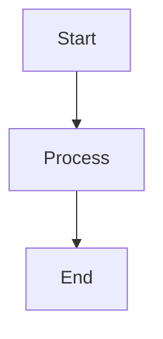

# Gospelo Backlog Docs

## Overview

Upload Markdown documents to Backlog Wiki with image and MermaidJS support.

### The Story Behind

One day in a development team's Slack channel:

> Engineer: "Where can I find the specs for this function?"
> Client: "In the head of Tanaka-san, who left the company last month."

The engineer looked up to the heavens and cried out:

> "Dear God, save me from this documentation-less hell!"

At that moment, there seemed to be a divine revelation:

> (Make it yourself.)

> "...Fine. I'll build it. Automatically."

And thus, **Gospelo** was born.

A documentation tool for engineers that delivers "words of salvation" to the documentation wasteland and helps the "specs are in my head" guy finally find peace.

> _The name "gospel" + "pelo" came from a late-night coding session where the developer thought "I felt like God told me to make it myself, so I did (・ω<)☆". Issues about naming sense are not accepted._

> _"Gospel" means "good news" or "words of salvation" in Christianity._

---

## What's New in v1.1.0

- **Directory batch processing** - Upload all Markdown files from a directory at once
- **Progress display** - Animated spinner with percentage and progress bar
- New options: `--no-recursive`, `--pattern`, `--exclude`, `--continue-on-error`

See [Changelog](https://github.com/gorosun/gospelo-backlog-docs/blob/main/docs/CHANGELOG.md) for full details.

---

## Features

- Upload Markdown files to Backlog Wiki
- **Batch upload from directories** with recursive search
- Automatic image upload and link conversion
- MermaidJS diagram conversion to PNG (requires mermaid-cli)
- Extract wiki page name from H1 title
- Support for hierarchical wiki page names (e.g., `Parent/Child/Page`)
- Flexible credential management (CLI args, environment variables, .env files)
- **Progress display** with spinner and percentage

## Installation

```bash
pip install gospelo-backlog-docs
```

### Optional: MermaidJS Support

To enable MermaidJS diagram conversion, install mermaid-cli:

```bash
npm install -g @mermaid-js/mermaid-cli
```

## Quick Start

### 1. Set up credentials

Create a `.env` file or set environment variables:

```bash
# .env
BACKLOG_SPACE_ID=your-space-id
BACKLOG_API_KEY=your-api-key
BACKLOG_DOMAIN=backlog.jp  # or backlog.com
```

Or use the global config directory:

```bash
mkdir -p ~/.config/gospelo-backlog-docs
cp .env.example ~/.config/gospelo-backlog-docs/.env
# Edit the file with your credentials
```

### 2. Upload Markdown files

```bash
# Single file
gospelo-backlog-docs document.md --project PROJECT_KEY

# All files in a directory (recursive)
gospelo-backlog-docs docs/ --project PROJECT_KEY
```

## Usage

```bash
gospelo-backlog-docs <path> --project <PROJECT_KEY> [options]
```

### Arguments

| Argument              | Description                                            |
| --------------------- | ------------------------------------------------------ |
| `path`                | Path to Markdown file or directory                     |
| `--project, -p`       | Backlog project key (required)                         |
| `--wiki-name, -n`     | Wiki page name (only for single file)                  |
| `--space-id, -s`      | Backlog space ID                                       |
| `--api-key, -k`       | Backlog API key                                        |
| `--domain, -d`        | Backlog domain (default: backlog.jp)                   |
| `--env-file, -e`      | Path to .env file                                      |
| `--dry-run`           | Parse only, do not upload                              |
| `--no-recursive`      | Do not search subdirectories                           |
| `--pattern`           | File pattern to match (default: *.md)                  |
| `--exclude`           | Patterns to exclude (can be specified multiple times)  |
| `--continue-on-error` | Continue uploading remaining files even if one fails   |
| `--version, -v`       | Show version                                           |

### Examples

```bash
# Upload a single file
gospelo-backlog-docs docs/design.md --project MYPROJECT

# Specify wiki page name (single file only)
gospelo-backlog-docs docs/design.md --project MYPROJECT --wiki-name "Design/UI Spec"

# Upload all Markdown files in a directory (recursive)
gospelo-backlog-docs docs/ --project MYPROJECT

# Upload only top-level files (no subdirectories)
gospelo-backlog-docs docs/ --project MYPROJECT --no-recursive

# Upload only spec files
gospelo-backlog-docs docs/ --project MYPROJECT --pattern "*_spec.md"

# Exclude README and draft files
gospelo-backlog-docs docs/ --project MYPROJECT --exclude "README.md" --exclude "*_draft.md"

# Continue uploading even if some files fail
gospelo-backlog-docs docs/ --project MYPROJECT --continue-on-error

# Dry run (parse without uploading)
gospelo-backlog-docs docs/design.md --project MYPROJECT --dry-run

# Use specific .env file
gospelo-backlog-docs docs/design.md --project MYPROJECT --env-file .env.production
```

## Credential Priority

Credentials are resolved in the following order (highest priority first):

1. CLI arguments (`--space-id`, `--api-key`, `--domain`)
2. Environment variables (`BACKLOG_SPACE_ID`, `BACKLOG_API_KEY`, `BACKLOG_DOMAIN`)
3. Specified .env file (`--env-file`)
4. Local `.env` file (current directory)
5. Global config `~/.config/gospelo-backlog-docs/.env`

## Markdown Features

### Images

Local images are automatically uploaded:

```markdown

```

External URLs are preserved as-is:

```markdown

```

### MermaidJS Diagrams

MermaidJS code blocks are converted to PNG images (requires mermaid-cli):

````markdown

````

### Wiki Page Name

The wiki page name is determined by:

1. `--wiki-name` argument (if specified)
2. First H1 title in the Markdown file
3. Filename (without extension)

Hierarchical names are supported:

```markdown
# Parent/Child/Page Name
```

## Requirements

- Python 3.10+
- requests
- python-dotenv
- mermaid-cli (optional, for MermaidJS support)

## Documentation

- [Japanese README](https://github.com/gorosun/gospelo-backlog-docs/blob/main/docs/README_jp.md)
- [Changelog](https://github.com/gorosun/gospelo-backlog-docs/blob/main/docs/CHANGELOG.md)
- [Contributing Guide](https://github.com/gorosun/gospelo-backlog-docs/blob/main/docs/CONTRIBUTING.md)
- [Test Report](https://github.com/gorosun/gospelo-backlog-docs/blob/main/docs/test/test_report.md)

## License

MIT License - see [LICENSE](https://github.com/gorosun/gospelo-backlog-docs/blob/main/LICENSE) for details.

## Third-Party Licenses

See [THIRD_PARTY_LICENSES.md](https://github.com/gorosun/gospelo-backlog-docs/blob/main/THIRD_PARTY_LICENSES.md) for dependency licenses.
