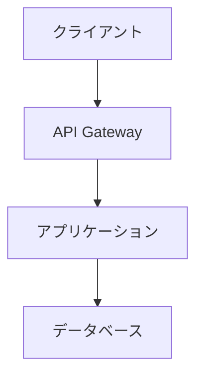

# クイックスタートガイド

このガイドでは、gospelo-backlog-docs を使って Markdown ドキュメントを Backlog Wiki にアップロードする手順を説明します。

## 1. インストール

```bash
pip install gospelo-backlog-docs
```

インストール確認：

```bash
gospelo-backlog-docs --version
```

## 2. Backlog API キーの取得

1. Backlog にログイン
2. 右上のユーザーアイコン → 「個人設定」
3. 「API」タブを選択
4. 「新しいAPIキーを発行」をクリック
5. メモ（任意）を入力して「登録」
6. 表示された API キーをコピー

## 3. 認証情報の設定

### 方法 A: グローバル設定（推奨）

一度設定すれば、どのディレクトリからでも使用できます。

```bash
# 設定ディレクトリを作成
mkdir -p ~/.config/gospelo-backlog-docs

# 設定ファイルを作成
cat > ~/.config/gospelo-backlog-docs/.env << 'EOF'
BACKLOG_SPACE_ID=your-space-id
BACKLOG_API_KEY=your-api-key
BACKLOG_DOMAIN=backlog.jp
EOF
```

**設定値の説明：**

| 項目 | 説明 | 例 |
|------|------|-----|
| BACKLOG_SPACE_ID | Backlog のスペース ID（URL の最初の部分） | `mycompany`（mycompany.backlog.jp の場合） |
| BACKLOG_API_KEY | 取得した API キー | `AbCdEfGhIjKlMnOp...` |
| BACKLOG_DOMAIN | Backlog のドメイン | `backlog.jp` または `backlog.com` |

### 方法 B: プロジェクトごとの設定

プロジェクトのルートディレクトリに `.env` ファイルを作成：

```bash
# .env
BACKLOG_SPACE_ID=your-space-id
BACKLOG_API_KEY=your-api-key
BACKLOG_DOMAIN=backlog.jp
```

## 4. 基本的な使い方

### シンプルなアップロード

```bash
gospelo-backlog-docs document.md --project PROJECT_KEY
```

- `document.md`: アップロードする Markdown ファイル
- `PROJECT_KEY`: Backlog のプロジェクトキー（例：`MYPROJ`）

### ディレクトリ一括アップロード

```bash
# ディレクトリ内の全Markdownファイルをアップロード（再帰的）
gospelo-backlog-docs docs/ --project PROJECT_KEY

# サブディレクトリを除外
gospelo-backlog-docs docs/ --project PROJECT_KEY --no-recursive

# 特定のパターンのみ
gospelo-backlog-docs docs/ --project PROJECT_KEY --pattern "*_spec.md"

# READMEを除外
gospelo-backlog-docs docs/ --project PROJECT_KEY --exclude "README.md"
```

### ドライラン（テスト実行）

実際にアップロードせずに、処理内容を確認：

```bash
gospelo-backlog-docs document.md --project PROJECT_KEY --dry-run
```

### Wiki ページ名を指定

```bash
gospelo-backlog-docs document.md --project PROJECT_KEY --wiki-name "設計書/API仕様"
```

## 5. 実践例

### 例 1: シンプルな Markdown をアップロード

```markdown
# API設計書

## 概要

このドキュメントはAPIの設計について記載しています。

## エンドポイント

- GET /users
- POST /users
```

```bash
gospelo-backlog-docs api_design.md --project MYPROJ
```

→ Wiki ページ「API設計書」が作成されます

### 例 2: 画像付きドキュメント

```markdown
# 画面設計

## ログイン画面


```

```bash
gospelo-backlog-docs screen_design.md --project MYPROJ
```

→ 画像が自動的に Backlog にアップロードされ、リンクが変換されます

### 例 3: MermaidJS 図付きドキュメント

```markdown
# システム構成


```

```bash
gospelo-backlog-docs system_design.md --project MYPROJ
```

→ Mermaid 図が PNG 画像に変換されてアップロードされます

**注意**: MermaidJS を使用するには mermaid-cli が必要です：

```bash
npm install -g @mermaid-js/mermaid-cli
```

## 6. トラブルシューティング

### エラー: 認証情報が見つからない

```
Error: BACKLOG_SPACE_ID is required
```

→ `.env` ファイルまたは環境変数を設定してください

### エラー: プロジェクトが見つからない

```
Error: Project not found
```

→ プロジェクトキーが正しいか確認してください（大文字で入力）

### エラー: API キーが無効

```
Error: 401 Unauthorized
```

→ API キーが正しいか、有効期限が切れていないか確認してください

## 次のステップ

- [詳細な使用方法](README_jp.md)
- [コントリビューションガイド](CONTRIBUTING_jp.md)
- [変更履歴](CHANGELOG_jp.md)
