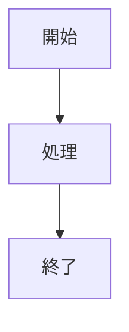

# Gospelo Backlog Docs

## 概要

Markdown ドキュメントを Backlog Wiki にアップロードするツールです。画像と MermaidJS 図のサポート付き。

### 開発経緯

ある日の開発チーム Slack にて：

> エンジニア「この関数の仕様ってどこに？」
> お客様「先月転職した田中さんの頭の中」

エンジニアは天を仰いで叫んだ。

> 「神様、ドキュメントがない地獄から救ってくれ！」

その瞬間、神の啓示があった気がした。

> （自分で作りなさい）

> 「...じゃあ作るか。自動で。」

こうして生まれたのが **Gospelo**。

ドキュメントなき荒野に "救いの言葉" を届け、
「仕様は俺の頭の中」おじさんを成仏させる、
エンジニアのためのドキュメント生成ツールである。

> ※「gospel」+「pelo」は「自分で作れという神の啓示があった気がしたので、作っちゃった (・ω<)☆」という深夜テンションでつけた。命名センスについての issue は受け付けていない。

> ※「福音（Gospel）」とは？
> キリスト教で「良い知らせ」「救いの言葉」を意味する言葉。

---

Markdown ドキュメントを Backlog Wiki にアップロードするツールです。画像と MermaidJS 図のサポート付き。

## 機能

- Markdown ファイルを Backlog Wiki にアップロード
- 画像の自動アップロードとリンク変換
- MermaidJS 図の PNG 変換（mermaid-cli 必要）
- H1 タイトルから Wiki ページ名を自動抽出
- 階層構造の Wiki ページ名をサポート（例：`親/子/ページ`）
- 柔軟な認証情報管理（CLI 引数、環境変数、.env ファイル）

## インストール

```bash
pip install gospelo-backlog-docs
```

### オプション：MermaidJS サポート

MermaidJS 図の変換を有効にするには、mermaid-cli をインストールしてください：

```bash
npm install -g @mermaid-js/mermaid-cli
```

## クイックスタート

### 1. 認証情報の設定

`.env`ファイルを作成するか、環境変数を設定します：

```bash
# .env
BACKLOG_SPACE_ID=your-space-id
BACKLOG_API_KEY=your-api-key
BACKLOG_DOMAIN=backlog.jp  # または backlog.com
```

または、グローバル設定ディレクトリを使用：

```bash
mkdir -p ~/.config/gospelo-backlog-docs
cp .env.example ~/.config/gospelo-backlog-docs/.env
# ファイルを編集して認証情報を設定
```

### 2. Markdown ファイルをアップロード

```bash
gospelo-backlog-docs document.md --project PROJECT_KEY
```

## 使用方法

```bash
gospelo-backlog-docs <markdown_file> --project <PROJECT_KEY> [options]
```

### 引数

| 引数              | 説明                                                     |
| ----------------- | -------------------------------------------------------- |
| `markdown_file`   | アップロードする Markdown ファイルのパス                 |
| `--project, -p`   | Backlog プロジェクトキー（必須）                         |
| `--wiki-name, -n` | Wiki ページ名（デフォルト：H1 タイトルまたはファイル名） |
| `--space-id, -s`  | Backlog スペース ID                                      |
| `--api-key, -k`   | Backlog API キー                                         |
| `--domain, -d`    | Backlog ドメイン（デフォルト：backlog.jp）               |
| `--env-file, -e`  | .env ファイルのパス                                      |
| `--dry-run`       | 解析のみ、アップロードしない                             |
| `--version, -v`   | バージョン表示                                           |

### 使用例

```bash
# 基本的なアップロード
gospelo-backlog-docs docs/design.md --project MYPROJECT

# Wikiページ名を指定
gospelo-backlog-docs docs/design.md --project MYPROJECT --wiki-name "設計/UI仕様"

# ドライラン（アップロードせずに解析のみ）
gospelo-backlog-docs docs/design.md --project MYPROJECT --dry-run

# 特定の.envファイルを使用
gospelo-backlog-docs docs/design.md --project MYPROJECT --env-file .env.production
```

## 認証情報の優先順位

認証情報は以下の順序で解決されます（優先度の高い順）：

1. CLI 引数（`--space-id`, `--api-key`, `--domain`）
2. 環境変数（`BACKLOG_SPACE_ID`, `BACKLOG_API_KEY`, `BACKLOG_DOMAIN`）
3. 指定された.env ファイル（`--env-file`）
4. ローカルの`.env`ファイル（カレントディレクトリ）
5. グローバル設定 `~/.config/gospelo-backlog-docs/.env`

## Markdown の機能

### 画像

ローカル画像は自動的にアップロードされます：

```markdown

```

外部 URL はそのまま保持されます：

```markdown

```

### MermaidJS 図

MermaidJS コードブロックは PNG 画像に変換されます（mermaid-cli 必要）：

````markdown

````

### Wiki ページ名

Wiki ページ名は以下の順序で決定されます：

1. `--wiki-name`引数（指定された場合）
2. Markdown ファイル内の最初の H1 タイトル
3. ファイル名（拡張子なし）

階層構造の名前もサポート：

```markdown
# 親カテゴリ/子カテゴリ/ページ名
```

## 必要要件

- Python 3.10+
- requests
- python-dotenv
- mermaid-cli（オプション、MermaidJS サポート用）

## ドキュメント

- [英語版 README](../README.md)
- [変更履歴](CHANGELOG_jp.md)
- [コントリビューションガイド](CONTRIBUTING_jp.md)
- [テストレポート](test/test_report_jp.md)

## ライセンス

MIT License - 詳細は[LICENSE](../LICENSE)を参照してください。

## サードパーティライセンス

依存ライブラリのライセンスは[THIRD_PARTY_LICENSES.md](../THIRD_PARTY_LICENSES.md)を参照してください。
